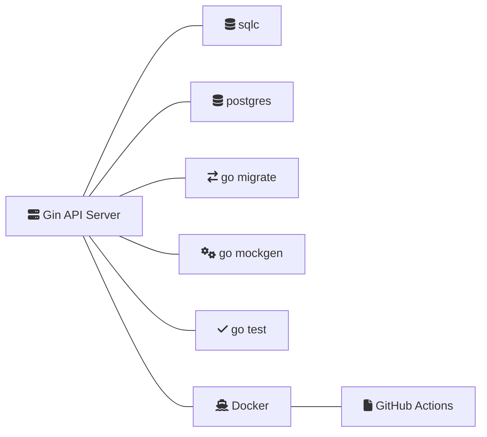

# 專案介紹
本專案主要使用Gin框架實作API之CRUD，並將資料存在以docker容器管理之PostgreSQL。

## 主要特色
**自動化單元測試**: 透過GitHub Actions在每次push時自動執行backend的單元測試，這可以確保每次的更動都不會對已經存在的功能產生不期望

## 使用技術
1. [Gin-gonic](https://github.com/gin-gonic/gin): Gin是用Go語言編寫的web框架，它是高效且靈活的。
2. [sqlc](https://github.com/sqlc-dev/sqlc): 是用Go實作之SQL Compiler，可以使用SQL語句來生成類型安全的Go語言程式碼的工具。
3. [postgres](https://www.postgresql.org/): 使用postgres作為資料庫系統，它是功能強大且穩定的開源資料庫系統。
4. [go migrate](https://github.com/golang-migrate/migrate): 是用Go語言撰寫的資料庫遷移工具，可以方便的進行資料庫的版本控制。
5. [go mockgen](https://github.com/golang/mock): 是用於生成Go語言的mock物件的工具，可以方便的進行單元測試。
6. [go test](https://pkg.go.dev/testing): Go語言的內建測試工具。

## DevOps使用技術
1. [Docker](https://www.docker.com/): 利用容器技術，可以方便的進行應用程式的擴展和部署，這裡使用docker-compose up命令來完成整個架構的部署。
2. [GitHub Actions](https://github.com/features/actions): 這是一個CI/CD(持續整合/持續部署)工具，可以自動執行單元測試，並且自動部署到GitHub Pages site。

## 架構圖
